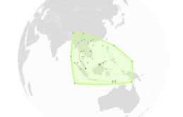
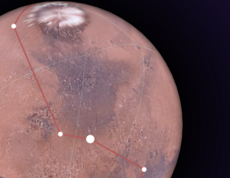

# d3-geo-voronoi

This module wraps d3 around Loren Petrich's [Spherical Delaunay triangulation library](http://lpetrich.org/Science/GeometryDemo/GeometryDemo_GMap.html), following as closely as possible the API of the [d3-voronoi](https://github.com/d3/d3-voronoi/) module.

Given a set of points in spherical coordinates `[lon, lat]`, it computes their Delaunay triangulation and its dual, the Voronoi diagram.

In addition, it offers convenience methods to create the convex hull, the [Urquhart graph](https://en.wikipedia.org/wiki/Urquhart_graph) of the set of sites, to extract the circumcenters of the Delaunay triangles, and to find the cell that contains any given point on the sphere.


## Installing

If you use NPM, `npm install d3-geo-voronoi`. Otherwise, download the [latest release](https://github.com/d3/d3-geo-voronoi/releases/latest).


## API Reference

<a href="#geo-voronoi" name="geo-voronoi">#</a> d3.<b>geoVoronoi</b>()
[<>](https://github.com/d3/d3-geo-voronoi/blob/master/src/geoVoronoi.js "Source")

Creates a new *spherical* Voronoi layout.

The following methods are similar to [d3-voronoi](https://github.com/d3/d3-voronoi/)'s methods:

- <i>voronoi</i>.<b>x</b>([<i>x</i>])

Defines or returns the _x_ accessor.

- <i>voronoi</i>.<b>y</b>([<i>y</i>])

Defines or returns the _y_ accessor.

- <i>voronoi</i>.<b>polygons</b>(<i>[data]</i>)

- <i>voronoi</i>.<b>triangles</b>(<i>[data]</i>)

Returns the spherical Delaunay triangulation.

[](http://bl.ocks.org/Fil/955da86d6a935b26d3599ca5e344fb38)

- <i>voronoi</i>.<b>links</b>(<i>[data]</i>)

- <i>voronoi</i>.<b>extent</b>(<i>[extent]</i>) and <i>voronoi</i>.<b>size</b>(<i>[size]</i>) are defined, but not implemented


The following new methods are introduced:

<a name="geo_voronoi_hull" href="#geo_voronoi_hull">#</a> <i>voronoi</i>.<b>hull</b>(<i>data</i>)

Returns the spherical convex hull of the *data* array. Returns null if the set of points span more than 180 degrees on the sphere. Equivalent to:

```js
voronoi(data).hull();
```

[](http://bl.ocks.org/Fil/6a1ed09f6e5648a5451cb130f2b13d20)

<a name="geo_voronoi_urquhart" href="#geo_voronoi_urquhart">#</a> <i>voronoi</i>.<b>urquhart</b>(<i>data</i>)

Returns the Urquhart graph of the specified *data* array as an array of links. Each link is a `{ source: … , target: … }` object similar to <i>voronoi</i>.<b>links</b>(). Equivalent to:

```js
voronoi(data).urquhart();
```

[](http://bl.ocks.org/Fil/1c2f954201523af16280db018ddd90cc)

<a name="geo_voronoi_circumcenters" href="#geo_voronoi_circumcenters">#</a> <i>voronoi</i>.<b>circumcenters</b>(<i>data</i>)

Returns the circumcenters of the Delaunay triangles of the specified *data* array, as an array of points. Equivalent to:

```js
voronoi(data).circumcenters();
```

<a name="geo_voronoi_find" href="#geo_voronoi_find">#</a> <i>voronoi</i>.<b>find</b>(<i>x,y,[angle]</i>)

Finds the closest site to point *x,y*, i.e. the Voronoi polygon that contains it. Optionally, return null if the distance between the point and the site is larger than *angle* radians.

[](http://bl.ocks.org/Fil/e94fc45f5ed4dbcc989be1e52b797fdd)


### Voronoi Diagrams

Like in the planar version, the underlying Diagram contains *cells* and *edges*. However, they are exposed only for compatibility with d3.voronoi -- the polygons, triangles etc. are computed from a (private) data structure.

