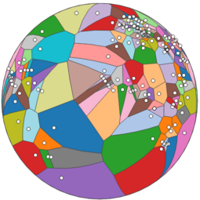
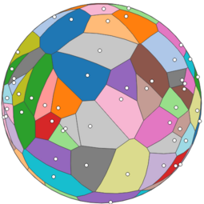
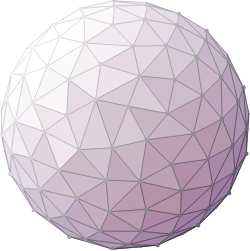
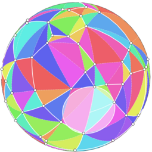
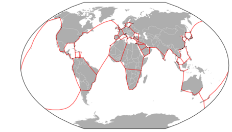

# d3-geo-voronoi

This module adapts [d3-delaunay](https://github.com/d3/d3-delaunay) for spherical data. Given a set of objects in spherical coordinates, it computes their Delaunay triangulation and its dual, the Voronoi diagram.

In addition, it offers convenience methods to extract the convex hull, the Urquhart graph, the circumcenters of the Delaunay triangles, and to find the cell that contains any given point on the sphere.

The module offers two APIs.

The GeoJSON API is the most convenient for drawing the results on a map. It follows as closely as possible the API of the [d3-voronoi](https://github.com/d3/d3-voronoi/) module. It is available with *d3.geoVoronoi()*.

A lighter API is available with *d3.geoDelaunay()*. It offers the same contents, but with a different presentation, where every vertex, edge, polygon… is referenced by an id rather than by its coordinates. This allows a more compact representation in memory and eases topology computations.


## Installing

If you use NPM, `npm install d3-geo-voronoi`. Otherwise, download the [latest release](https://unpkg.com/d3-geo-voronoi).


## API Reference

<a href="#geo-delaunay" name="geo-delaunay">#</a> d3.<b>geoDelaunay</b>([data])
[<>](https://github.com/Fil/d3-geo-voronoi/blob/master/src/delaunay.js "Source")

Creates a new *spherical* Voronoi layout. _data_ must be passed as an array of [lon, lat] coordinates.


- delaunay.find(x,y,node): pass a starting node (_not_ a radius).

- delaunay.urquhart(*distances*): retrieve a vector of urquhart edges indices.

- delaunay.hull(): list of indices of points on the hull (empty if the points cover more than a hemisphere).

- delaunay.edges: list of edges as indices of points [from, to] (might change to a typed in the future)

- delaunay.triangles: list of edges as indices of points [a, b, c] (might change to a typed in the future)

- delaunay.centers: list of centers in spherical coordinates; the first *t* centers are the *t* triangles’s circumcenters. More centers might be listed in order to build the voronoi diagram for degenerate cases such as n=1,2,3 points.

- delaunay.neighbors, an array of neighbors indices for each vertex.

- delaunay.polygons, an array of centers for each vertex, order in a clockwise manner.

- delaunay.mesh, a list of all the edges of the voronoi polygons


<a href="#geo-voronoi" name="geo-voronoi">#</a> d3.<b>geoVoronoi</b>([data])
[<>](https://github.com/Fil/d3-geo-voronoi/blob/master/src/voronoi.js "Source")

Creates a new *spherical* Voronoi layout. _data_ can be passed as an array of [lon, lat] coordinates, an array of GeoJSON features, or a GeoJSON FeatureCollection.

The following methods are similar to [d3-voronoi](https://github.com/d3/d3-voronoi/)'s methods:

<a href="#geo_voronoi_delaunay" name="geo_voronoi_delaunay">#</a> <i>voronoi</i>.<b>delaunay</b>

The raw d3.geoDelaunay() object used to compute this diagram. 

<a href="#geo_voronoi_x" name="geo_voronoi_x">#</a> <i>voronoi</i>.<b>x</b>([<i>x</i>])

Sets or returns the _x_ accessor. The default _x_ and _y_ accessors are smart enough to recognize GeoJSON objects and return the geoCentroid of each feature.

<a href="#geo_voronoi_y" name="geo_voronoi_y">#</a> <i>voronoi</i>.<b>y</b>([<i>y</i>])

Sets or returns the _y_ accessor.

[](https://bl.ocks.org/Fil/74295d9ffe097ae4e3c93d7d00377d45)

<a href="#geo_voronoi_polygons" name="geo_voronoi_polygons">#</a> <i>voronoi</i>.<b>polygons</b>(<i>[data]</i>)

Returns the Voronoi tessellation of the data as a GeoJSON collection of polygons. (If there is only one data point, returns the Sphere). Each polygon exposes its datum in its properties.

[](https://bl.ocks.org/Fil/a9ba8d0d023752aa580bd95480b7de60)

<a href="#geo_voronoi_cellMesh" name="geo_voronoi_cellMesh">#</a> <i>voronoi</i>.<b>cellMesh</b>(<i>[data]</i>)

Returns the Voronoi tessellation as a GeoJSON mesh (MultiLineString).

<a href="#geo_voronoi_triangles" name="geo_voronoi_triangles">#</a> <i>voronoi</i>.<b>triangles</b>(<i>[data]</i>)

Returns the Voronoi tessellation of the data as a GeoJSON collection of polygons. Each triangle exposes in its properties the three sites, its spherical area (in steradians), and its circumcenter.


[](https://bl.ocks.org/Fil/b1ef96e4bc991eb274f8d3a0a08932f9)

[](https://bl.ocks.org/Fil/955da86d6a935b26d3599ca5e344fb38)

<a href="#geo_voronoi_mesh" name="geo_voronoi_mesh">#</a> <i>voronoi</i>.<b>mesh</b>(<i>[data]</i>)

Returns the Delaunay edges [as a GeoJSON mesh](https://bl.ocks.org/Fil/fbaf391e1ae252461741ccf401af5a10) (MultiLineString).


<a href="#geo_voronoi_links" name="geo_voronoi_links">#</a> <i>voronoi</i>.<b>links</b>(<i>[data]</i>)

Returns the Delaunay links of the data as a GeoJSON collection of lines. Each line exposes its source and target in its properties, but also its length (in radians), and a boolean flag for links that belong to the [Urquhart graph](https://en.wikipedia.org/wiki/Urquhart_graph).

[](https://bl.ocks.org/Fil/1a78acf8b9b40fe8ecbae7b5035acf2b)


[](https://bl.ocks.org/Fil/79b9f17979c4070dee3cbba1c5283502)


[](https://bl.ocks.org/Fil/1c2f954201523af16280db018ddd90cc)


<i>voronoi</i>.<b>extent</b>(<i>[extent]</i>) and <i>voronoi</i>.<b>size</b>(<i>[size]</i>) are not implemented.

Indeed, defining the “paper extent” of the geoVoronoi polygons can be quite tricky, [as this block demonstrates](https://bl.ocks.org/Fil/6128aae082c04eef06422f953d0f593f).


<a name="geo_voronoi_find" href="#geo_voronoi_find">#</a> <i>voronoi</i>.<b>find</b>(<i>x,y,[angle]</i>)

Finds the closest site to point *x,y*, i.e. the Voronoi polygon that contains it. Optionally, return null if the distance between the point and the site is larger than *angle* degrees.

[](https://bl.ocks.org/Fil/e94fc45f5ed4dbcc989be1e52b797fdd)


<a name="geo_voronoi_hull" href="#geo_voronoi_hull">#</a> <i>voronoi</i>.<b>hull</b>(<i>data</i>)

Returns the spherical convex hull of the *data* array, as a GeoJSON polygon. Returns null if the dataset spans more than a hemisphere. Equivalent to:

```js
voronoi(data).hull();
```

[](https://bl.ocks.org/Fil/6a1ed09f6e5648a5451cb130f2b13d20)


### Other tools & projections

There is no reason to limit the display of Voronoi cells to the orthographic projection. The example below displays the Urquhart graph of top container ports on a Winkel tripel map.

[](https://bl.ocks.org/Fil/24d5ee71f09ba72893323d803242c38a)

[Geo_triangulate](https://jessihamel.github.io/geo_triangulate/) converts GeoJSON to triangles for 3d rendering.


### Comparison with planar Voronoi Diagrams

- the Delaunay/Voronoi topology is quite different on the sphere and on the plane. This module deals with these differences by first projecting the points with a stereographic projection, then stitching the geometries that are near the singularity of the projection (the “infinite horizon” on the plane is one point on the sphere).

- geoVoronoi returns GeoJSON objects, which are often `FeatureCollections`. By consequence, you will have to change `.data(voronoi.polygons())` to `.data(geovoronoi.polygons().features)`, and so on.

- geoVoronoi is built on [d3-delaunay](https://github.com/d3/d3-delaunay), which is also exposed as d3.geoDelaunay in this library. If you want to have the fastest results, you should try to use d3.geoDelaunay directly (see the examples).

- geoVoronoi and geoDelaunay offer methods to compute the spherical [convex hull](#geo_voronoi_hull) and the [Urquhart graph](#geo_voronoi_links) of the data set. These can be achieved with the planar Voronoi ([hull](https://bl.ocks.org/mbostock/6f14f7b7f267a85f7cdc), [Urquhart](https://bl.ocks.org/Fil/df20827f817abd161c768fa18dcafcf5), but are not part of d3-voronoi or d3-delaunay.


### Changes

- the module needs d3-delaunay and doesn't embed it.

```
<script src="https://unpkg.com/d3-delaunay@4></script>
<script src="https://unpkg.com/d3-geo-voronoi@1"></script>
```

(To access the previous (slow) version, please use  `https://unpkg.com/d3-geo-voronoi@0`.)


