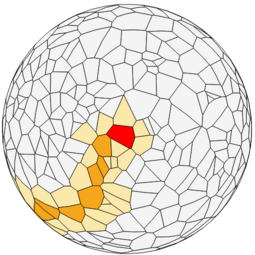

# d3-geo-voronoi

This module wraps d3 around Loren Petrich's [Spherical Delaunay triangulation library](http://lpetrich.org/Science/GeometryDemo/GeometryDemo_GMap.html), following as closely as possible the API of the [d3-voronoi](https://github.com/d3/d3-voronoi/) module.

Given a set of points in spherical coordinates `[lon, lat]`, it computes their Delaunay triangulation and its dual, the Voronoi diagram.

In addition, it offers convenience methods to extract the convex hull, the Urquhart graph, the circumcenters of the Delaunay triangles, and to find the cell that contains any given point on the sphere.


## Installing

If you use NPM, `npm install d3-geo-voronoi`. Otherwise, download the [latest release](https://github.com/d3/d3-geo-voronoi/releases/latest).


## API Reference

<a href="#geo-voronoi" name="geo-voronoi">#</a> d3.<b>geoVoronoi</b>()
[<>](https://github.com/d3/d3-geo-voronoi/blob/master/src/geoVoronoi.js "Source")

Creates a new *spherical* Voronoi layout.

The following methods are similar to [d3-voronoi](https://github.com/d3/d3-voronoi/)'s methods:

- <i>voronoi</i>.<b>x</b>([<i>x</i>])

Defines or returns the _x_ accessor.

- <i>voronoi</i>.<b>y</b>([<i>y</i>])

Defines or returns the _y_ accessor.

- <i>voronoi</i>.<b>polygons</b>(<i>[data]</i>)

Returns the Voronoi tesselation as a GeoJSON collection of polygons. (If there is only one data point, it returns the Sphere). Each polygon exposes its datum in its properties.

- <i>voronoi</i>.<b>triangles</b>(<i>[data]</i>)

Returns the spherical Delaunay triangulation as a GeoJSON collection of polygons. Each triangle exposes the three sites, the spherical area of the triangle (in steradians), the center and radius of the circumcircle in its properties.

[](http://bl.ocks.org/Fil/955da86d6a935b26d3599ca5e344fb38)

- <i>voronoi</i>.<b>links</b>(<i>[data]</i>)

Returns the Delaunay links as a GeoJSON collection of lines. Each line exposes its source and target in its properties, but also its length (in radians), and a boolean flag for links that belong to the [Urquhart graph](https://en.wikipedia.org/wiki/Urquhart_graph).

[](http://bl.ocks.org/Fil/1c2f954201523af16280db018ddd90cc)


- <i>voronoi</i>.<b>extent</b>(<i>[extent]</i>) and <i>voronoi</i>.<b>size</b>(<i>[size]</i>) are defined, but not implemented


The following new methods are introduced:

<a name="geo_voronoi_hull" href="#geo_voronoi_hull">#</a> <i>voronoi</i>.<b>hull</b>(<i>data</i>)

Returns the spherical convex hull of the *data* array, as a GeoJSON polygon. Returns null if the dataset spans more than a hemisphere. Equivalent to:

```js
voronoi(data).hull();
```

[](http://bl.ocks.org/Fil/6a1ed09f6e5648a5451cb130f2b13d20)

<a name="geo_voronoi_find" href="#geo_voronoi_find">#</a> <i>voronoi</i>.<b>find</b>(<i>x,y,[angle]</i>)

Finds the closest site to point *x,y*, i.e. the Voronoi polygon that contains it. Optionally, return null if the distance between the point and the site is larger than *angle* radians.

[](http://bl.ocks.org/Fil/e94fc45f5ed4dbcc989be1e52b797fdd)


### Voronoi Diagrams

Like in the planar version, the underlying Diagram contains *cells* and *edges*. However, they are exposed only for compatibility with d3.voronoi -- the polygons, triangles etc. are computed from a (private) data structure.

